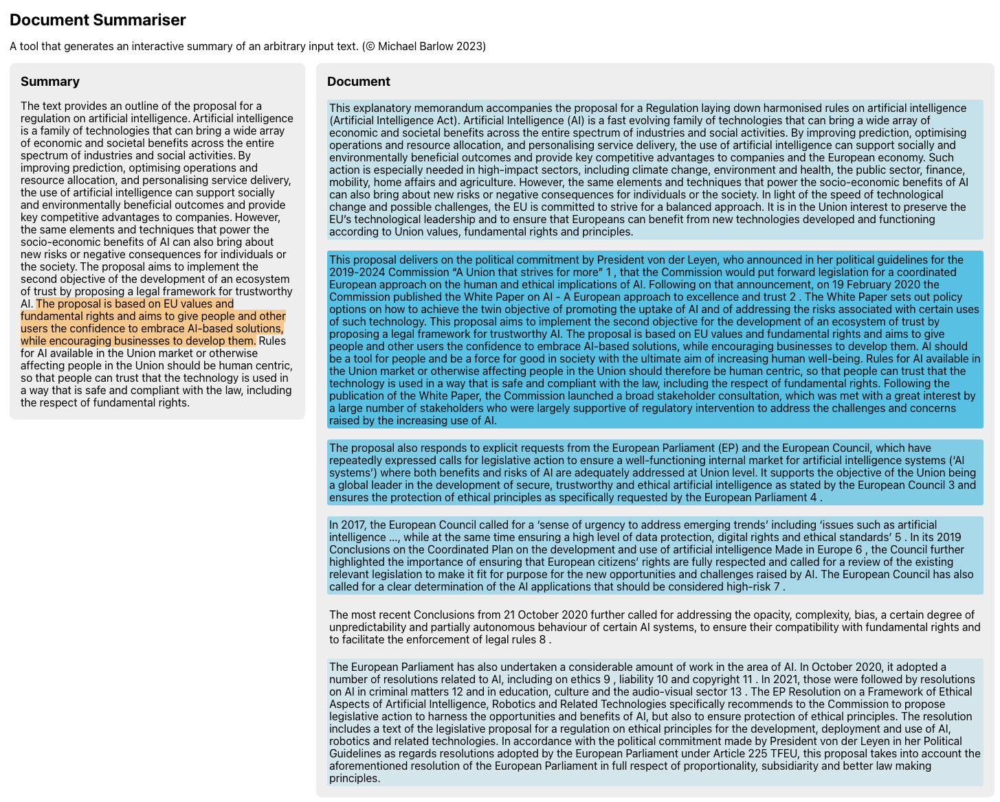

# document-summariser

Document Summariser is a tool that generates interactive summaries from text using GPT. Given an input document, the tool will first generate a summary using GPT. Then, when a user selects a sentence in the summary, the tool generates a relevance mapping between that sentence and the paragraphs in the document. It does this by computing the pairwise cosine similarity between the summary text embedding vector and each of the paragraph text embedding vectors. The tool also uses GPT to generate these text embeddings. This relevance mapping is rendered as a heatmap, with darker highlighting indicating higher relevance to the summary sentence.

_Note: this app was put together as a proof of concept. As a result, some shortcuts were taken during development._

## Instructions

### Server

The server is built with Python@^3.9, FastAPI and some helper packages for things like typing/validation, reading from `.env`, OpenAI interaction and NLP. It is built using [Poetry](https://python-poetry.org/), so make sure this is installed along with a suitable python version. The following steps describe how to run the server.

- Change into the server directory: `cd server`
- Add your OpenAI API key to a `.env` file: `echo 'OPENAI_API_KEY="<your-api-key>"' > .env`
- Install dependencies: `poetry install`
- Run the server: `poetry run python main.py`

### Client

The client is built with React and TypeScript, and was bootstrapped with `create-react-app`. The following steps describe how to run the client.

- Change into the client directory: `cd client`
- Install dependencies: `npm install`
- Run the client: `npm start`
- Navigate to `localhost:3000` in your browser

## Built with

- [React](https://react.dev/) - Client UI library
- [TypeScript](https://www.typescriptlang.org/) - Typing for JavaScript
- [npm](https://www.npmjs.com/) - JavaScript dependency management
- [OpenAI](https://openai.com/) - Completion and embeddings API
- [FastAPI](https://fastapi.tiangolo.com/) - Server framework
- [Poetry](https://python-poetry.org/) - Python dependency management
- [NLTK](https://www.nltk.org/) - NLP library for tokenisation

## License

[MIT license](./LICENSE)
